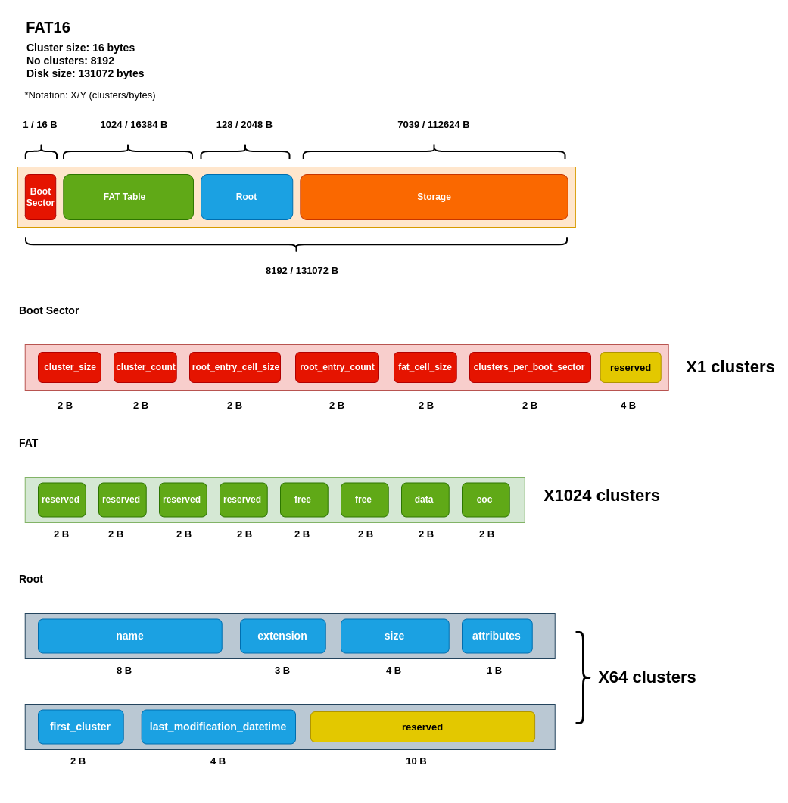
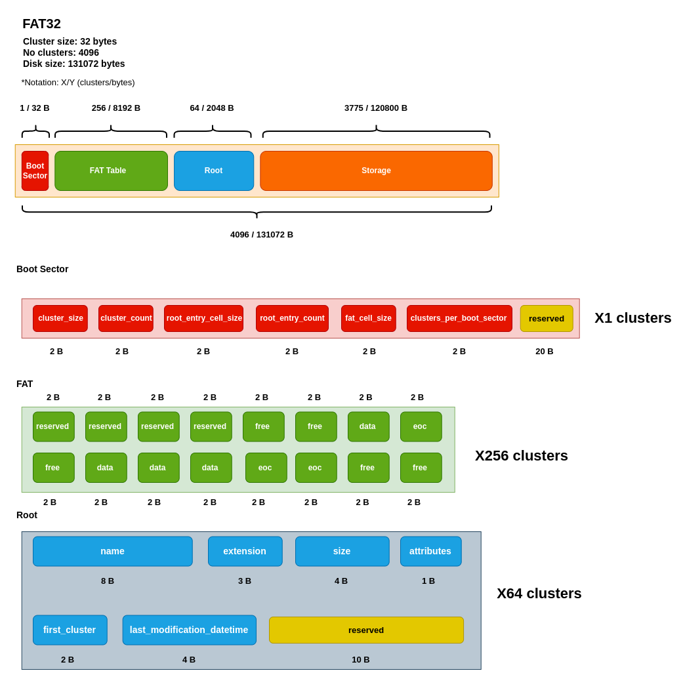

# RoDOS

> "It's a disk operating system, it's Rust-oriented, it's retro-inspired, no... it's **RoDOS**!"

Like the island of Rhodes in the Aegean Sea, RoDOS is built around a circular pattern - the disk - and designed to be reliable and resilient. 
Its minimalistic approach to functionality reflects the lo-fi charm of retro technology. 

But don't be fooled by its simplicity - RoDOS packs a punch with its lean and resourceful design, perfect for those who want a disk operating system that is both lightweight and responsive.

## How to run
- [Install Rust](https://doc.rust-lang.org/cargo/getting-started/installation.html)
- Clone the repository:
```bash
    git clone https://github.com/WarriorsSami/rodos.git
    cd rodos
```
- Install dependencies:
```bash
    cargo build
```
- Run RoDOS:
```bash
    cargo run
```
- After the program is run for the first time, a config folder embedding configuration options for both rodos itself and
  log4rs will be autogenerated alongside with a logs folder and the actual disk storage folder.

## Features
- TUI (Text User Interface) with a retro-inspired look
- User prompter (rouser@rodos:~$)
- Basic Commands:
  - **neofetch** - print system information
  - **ls** **[-\<filter>]** **[-name=<file_name>]** **[-ext=<file_extension>]** **[-\<sort>]** - list files in current directory by applying given filters and sorting options:
    ```bash
    rouser@rodos:~$ ls
    
    Current directory: /
    a.txt 40 bytes
    b.txt 40 bytes
    c.txt 40 bytes
    
    Free space: 1.5 MB 
    ```
    - compute free space by relating to allocated clusters
    - **\<filter>**:
      - *a*: show all visible files and directories
      - *h*: show all files and directories including hidden ones
      - *s*: show files and directories in short format (name and extension)
      - *l*: show files and directories in detailed format (attributes, name, extension, last modification date and size in bytes)
      - *f*: show all files
      - *d*: show all directories
    - **\<sort>**:
      - *n*: sort by name
      - *t*: sort by last modification date
      - *sz*: sort by size
      - **a*: sort in ascending order
      - **d*: sort in descending order
  - **create** `file_name` `dimension/none` `alfa/num/stdin` - create a file:
    ```bash
    rouser@rodos:~$ create a.txt 20 alfa
    
    a.txt file content:
    ABCDEFGHIJKLMNOPQRST
    ```
    - create a file entry in the ROOT directory if there is enough space
    - allocate the required number of clusters
    - if `stdin` is specified, the user can write the content of the file in a separate file simulating the stdin
    and then the content of the file is copied in the new file
  - **cp** `src_name` `dest_name` - copy a file:
    ```bash
    rouser@rodos:~$ copy a.txt b.txt
    
    b.txt file content:
    ABCDEFGHIJKLMNOPQRST
    ```
    - copy the file entry in the ROOT directory
    - allocate the required number of clusters
  - **rename** `old_name` `new_name` - rename a file:
    ```bash
    rouser@rodos:~$ rename a.txt c.txt
    
    c.txt file content:
    ABCDEFGHIJKLMNOPQRST
    ```
    - rename the file entry in the ROOT directory
  - **del** `file_name` - delete a file:
    ```bash
    rouser@rodos:~$ del c.txt
  
    File c.txt deleted
    ```
  - **cat** `file_name` - print the content of a file:
    ```bash
    rouser@rodos:~$ cat a.txt
    
    ABCDEFGHIJKLMNOPQRST
    ```
    - print the content of the file
    
## FAT16


## FAT32


## Advanced commands:
- **defrag** - defragment the disk:
  ```bash
  rouser@rodos:~$ defrag
  
  Disk defragmented
  ```
  - move all the files to the beginning of the disk
  - update the ROOT directory
  - update the FAT table
- **setattr** `file_name` `attrs` - set the attribute of a file:
  ```bash
  rouser@rodos:~$ setattr a.txt +w-h
  
  File attributes set successfully
  ```
  - set the attribute of a file entry in the ROOT directory
  - possible attributes: visible (-h), hidden (+h), read-only (-w), read-write (+w)
- **fmt** `fat_type` - format the disk:
  ```bash
  rouser@rodos:~$ fmt 32
  
  Disk formatted
  ```
  - format the disk
  - possible FAT types: fat16, fat32
- **mkdir** `folder_name` - create a folder:
  ```bash
  rouser@rodos:~$ mkdir folder
  
  Folder folder created
  ```
  - create a folder entry in the ROOT directory
  - allocate the required number of clusters
- **cd** `folder_name` - change the current directory:
  ```bash
  rouser@rodos:~$ cd folder
  
  Current directory: /folder
  ```
  - change the current directory
- **pwd** - print the current directory:
  ```bash
  rouser@rodos:~$ pwd
  
  Current directory: /folder
  ```
  - print the current directory
- **rmdir** `folder_name` - delete a folder:
  ```bash
    rouser@rodos:~$ rmdir folder
  
    Folder folder deleted
    ```
    - delete a folder entry in the ROOT directory
    - deallocate the clusters
    - delete the files in the folder recursively
- **help** `command_name` - print the global help menu or the help menu for a specific command
- **exit** - exit the program